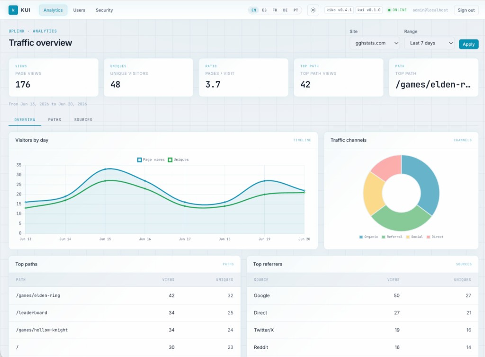
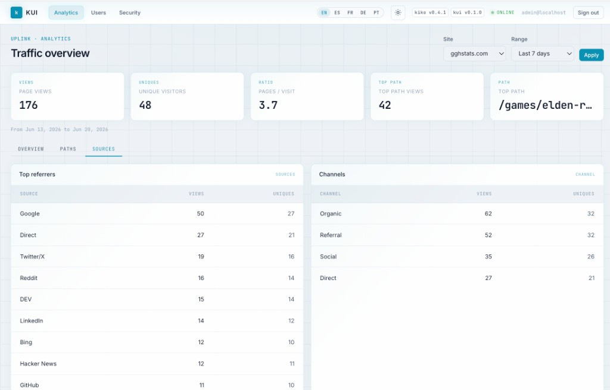

[](https://github.com/hrodrig/kui/releases)
[](https://github.com/hrodrig/kui/releases)
[](https://github.com/hrodrig/kui/actions)
[](https://github.com/hrodrig/kui/actions/workflows/security.yml)
[](https://github.com/hrodrig/kui/actions/workflows/codeql.yml)
[](https://codecov.io/gh/hrodrig/kui)
[](https://go.dev/)
[](https://opensource.org/licenses/MIT)
[](https://pkg.go.dev/github.com/hrodrig/kui)
[](https://goreportcard.com/report/github.com/hrodrig/kui)

**Repo:** [github.com/hrodrig/kui](https://github.com/hrodrig/kui) · **Releases:** [Releases](https://github.com/hrodrig/kui/releases)

> **Early development:** kui is in initial active development. Expect breaking changes, incomplete features, and data loss between releases (including users, sessions, and host ACLs in `kui.db`). **Do not use in production.**

Companion UI for **[kiko](https://github.com/hrodrig/kiko)** — privacy-first web analytics collector.

**kui** (*kiko* + *ui*) is the analytics dashboard: login, roles (`admin` / `user`), and charts/tables over kiko's stats API. kiko stays collection-only; kui owns users and sessions in its own SQLite database.

## Screenshots

**Overview** — KPIs, timeline, traffic channels, top paths and referrers:



**Sources** — referrers and acquisition channels:



_Screenshots use locally generated demo data for illustration._

**This repo is kui — the application only** (binary, UI, auth, kiko client). **[kui-selfhosted](https://github.com/hrodrig/kui-selfhosted)** is the companion deployment repo: Docker Compose, Helm, Kubernetes manifests, and example stacks wiring **kui + kiko** (same split as [kiko](https://github.com/hrodrig/kiko) / [kiko-selfhosted](https://github.com/hrodrig/kiko-selfhosted)).

## Features

- **Analytics dashboard** — KPIs, daily timeline, channel breakdown, top paths and referrers (7 / 30 / 90 day ranges)
- **Multi-site** — per-user host allowlists; admins see all configured hosts
- **User management** — create/edit users, roles, host access, admin 2FA reset
- **Optional 2FA** — TOTP (Google Authenticator, Authy, 1Password, …)
- **i18n** — English, Spanish, French, German, Portuguese (BR); cookie + `Accept-Language`
- **Light / dark theme** — persisted in `localStorage`
- **Version badges** — live kiko + kui build info in the header

## Stack

| Layer | Choice |
|-------|--------|
| Server | Go 1.26, single binary |
| UI | [templ](https://templ.guide) + [HTMX](https://htmx.org) |
| CSS | Custom `kui.css` design system + **Bootstrap 5.3** (vendored layout/forms) |
| Charts | **Chart.js 4.4** (vendored) |
| Users DB | SQLite (`kui.db`) — users, sessions, host ACLs, TOTP secrets |
| Stats | kiko Query API (`KIKO_URL` + `KIKO_API_KEY`, server-side only) |
| Auth | bcrypt passwords, cookie sessions, optional TOTP |

## Quick start (local)

**1. kiko** (separate terminal):

```bash
cd ../kiko   # or your kiko clone
make build
KIKO_API_KEY=local-dev-key ./kiko serve
```

**2. kui:**

```bash
make run
```

Open http://127.0.0.1:3000 — `admin@localhost` / `dev-admin`.

`make run` uses [`configs/kui.dev.yml`](configs/kui.dev.yml). Override via env:

```bash
KUI_ADMIN_PASSWORD=mypass KIKO_API_KEY=local-dev-key make run
```

**3. Demo data** (optional, dev only — populates kiko so the dashboard is not empty):

```bash
make seed-kiko              # quick hits via kiko API (today)
make seed-kiko-history      # 90 days backfilled in kiko SQLite (README screenshots)
```

Production template (no secrets): [`configs/kui.yml.sample`](configs/kui.yml.sample).

## Configuration

See [`configs/kui.yml.sample`](configs/kui.yml.sample). Main settings:

| Env / YAML | Description |
|------------|-------------|
| `KUI_LISTEN` | HTTP listen (default `:3000`) |
| `KUI_DATABASE_PATH` | SQLite path for users/sessions |
| `KUI_ADMIN_EMAIL` | First admin email (default `admin@localhost`) |
| `KUI_ADMIN_PASSWORD` | **Required** on first boot to seed admin |
| `KIKO_URL` | kiko base URL |
| `KIKO_API_KEY` | kiko stats API key (never sent to the browser) |
| `KUI_DEFAULT_LOCALE` | Default UI locale (`en`, `es`, `fr`, `de`, `pt-br`) |
| `KUI_ENABLED_LOCALES` | Comma-separated enabled locales |
| `KUI_SESSION_TTL_HOURS` | Session TTL with “remember me” (default 168) |
| `KUI_SESSION_SHORT_TTL_HOURS` | Session TTL without “remember me” (default 8) |
| `KUI_SESSION_SECURE` | `Secure` cookie flag (set `true` behind HTTPS) |

## Development

```bash
make help          # all targets
make test
make lint
make build
make run
make vendor-static # re-download Bootstrap, HTMX, Chart.js
```

`templ generate` runs automatically via `make build` / `make test`.

## Related

| Project | Role |
|---------|------|
| [kiko](https://github.com/hrodrig/kiko) | Analytics collector + stats API |
| [kui-selfhosted](https://github.com/hrodrig/kui-selfhosted) | Docker / Helm / K8s stacks (kui + kiko) |
| [kiko-selfhosted](https://github.com/hrodrig/kiko-selfhosted) | kiko-only deployment manifests |

## Docker

**Local / CI** (full build from source):

```bash
docker build -f Dockerfile -t ghcr.io/hrodrig/kui:v0.2.0 \
  --build-arg VERSION=0.2.0 .
docker run --rm -p 3000:3000 \
  -e KUI_ADMIN_PASSWORD=change-me \
  -e KIKO_URL=http://host.docker.internal:8080 \
  -e KIKO_API_KEY=your-key \
  -v kui-data:/data \
  ghcr.io/hrodrig/kui:v0.2.0
```

**Release** images use `Dockerfile.release` with a pre-built binary (GoReleaser `dockers_v2` → `ghcr.io/hrodrig/kui:v0.2.0`).

## Release

Tagged releases are built with [GoReleaser](https://goreleaser.com) (`.goreleaser.yaml`):

- Tarballs / zip per OS/arch
- `checksums.txt`
- Multi-arch images on **GHCR** (`ghcr.io/hrodrig/kui`)

Local dry-run:

```bash
make snapshot    # dist/ only, no publish
```

On push of tag `v*` (from `main`), GitHub Actions runs `make release-check` then `goreleaser release`.

| Check | Gate | CI / release |
|-------|------|--------------|
| gofmt -s | No diff | CI + release |
| go vet | 0 warnings | CI + release |
| gocyclo | ≤ 14 | CI + release |
| govulncheck | 0 vulnerabilities | CI + release |
| grype | 0 high/critical | CI + release |
| go test -cover | ≥ `COVERAGE_MIN` (4% now; target 80%) | CI + release |

Local check: `make release-check`

Full stack (kiko + kui): use **[kui-selfhosted](https://github.com/hrodrig/kui-selfhosted)** Compose or Helm.

## License

MIT — [LICENSE](LICENSE)

## Community

- [CHANGELOG](CHANGELOG.md)
- [Code of Conduct](CODE_OF_CONDUCT.md)
- [Contributing](CONTRIBUTING.md)
- [Security](SECURITY.md)
